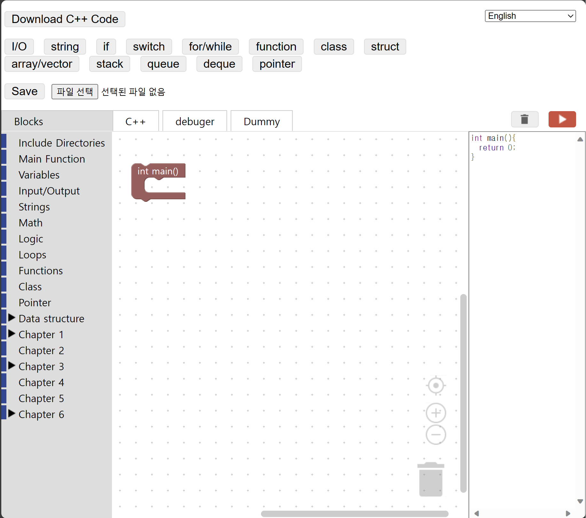

# Blockly C++ #

[click here to try the thing](./demos/code/index.html)

This project has modified by three student at Kwangwoon University.

You can access the original project through the link below.
Or check out the project I forked.
- https://github.com/Chris-Archive/Blockly_CPP

## Project purpose ##

- A block editor allows you to visually check the c++ language and learn with reduced grammatical errors.
- It allows users to see that when coded into blocks, it translates into real c++ code and learn it.
- Use the example questions to try and debug coding using the functionality of the c++ language.

## changes ##

- blockly_compressed.js
- demos/code.js
- demos/index.html
- demos/Blocks/Blocks - Type.js
- demos/Blocks/Changelog.js
- demos/Blocks/Chapter 7 - Classes.js
- demos/Blocks/Include.js

## Added features ##
1. Test buttons and examples
- An example using the functions added by Team 17 and the functions in the existing Blockly C++ was added.
- Press the button and you'll see an example where you can try out the features written there.
- You can check the tooltip to see what examples the number contains.

2. New blocks
- Class
- Queue
- Deque
- Stack

3. Debugging capabilities
- Click on the debugger button to go to the site where you can debug and test the code you created.
	[click here to try the site](https://www.programiz.com/cpp-programming/online-compiler/)

## How to use Blockly C++ ##
Blockly C++ can be used locally by going to demos/code and opening "index.html" with a browser.

## What the user should know ##
The problem with execution errors is that they are forced to transfer to c++ code in the original blockly development environment
 (following grammar such as javascript and python).
